# AI Operating Model — ERP Modernization Engagement

*Per-phase model: where AI participates in delivery, who owns each checkpoint, what gate it must pass, and which project result it improves.*

---

## Per-Phase Operating Model

| SDLC Phase   | Ritual                     | Cadence     | AI checkpoint (+ gate)                                                                      | Inputs                                                | Outputs                                                             | Accountable owner | Rollout stage | Exit gate                                                                                        | Project outcome improved |
| ------------ | -------------------------- | ----------- | ------------------------------------------------------------------------------------------- | ----------------------------------------------------- | ------------------------------------------------------------------- | ----------------- | ------------- | ------------------------------------------------------------------------------------------------ | ------------------------ |
| **Intake**   | Opportunity / scope triage | Weekly      | AI-assisted qualification summary; source check before sharing                              | RFP notes, sales emails, SOW draft                    | Qualification memo with source links                                | Delivery lead     | Pilot         | 3/3 consecutive summaries carry source links; unplanned scope changes ≤2 per month from sprint 2 | Scope stability          |
| **Plan**     | Backlog refinement         | Biweekly    | AI-drafted acceptance criteria reviewed by BA before merge                                  | PRD draft, existing story cards                       | Refined backlog with reviewed ACs                                   | BA lead           | Expand        | ≥80% of stories merged in sprint carry BA-reviewed ACs (tracked from sprint 3)                   | Delivery predictability  |
| **Build**    | Sprint review + PR cycle   | Biweekly    | (1) AI tool (CodeMie / DIAL) reviews the code diff and produces a review summary; tech lead reads it and signs every AI-authored change before merge. (2) CI lint step validates all files in the `rules/` repo (format, required fields, no broken references) and must return 0 errors. Both checks must be green for a PR to merge. | Code, `rules/` repo                                   | PR evidence block: AI-assist tag + tech-lead sign-off + lint = 0 result | Tech lead         | Standardize   | Lint = 0 errors for 4 consecutive weeks; 0 PRs merged without tech-lead sign-off on AI-authored changes | Cycle time and quality   |
| **Validate** | Test-pack review           | Per sprint  | AI-generated test cases reviewed by QA lead; golden-set run before merge                    | PRD, code, existing test files                        | Test pack with golden-set results; QA sign-off                      | QA lead           | Pilot         | Golden-set pass rate ≥90% at sprint 6 retrospective; 0 critical safety failures                  | Defect escape            |
| **Handoff**  | Release readiness review   | Per release | Decision Memory completeness check; all release decisions logged before sign-off            | Release notes, decision log, GDPR compliance artefact | Handoff pack: decision log snapshot + release readiness certificate | Delivery lead     | Pilot         | 100% of release decisions have owner, rationale, rejected option, and date                       | Go-live readiness        |
| **Learn**    | Sprint retrospective       | Biweekly    | AI clusters retro themes and drafts improvement artefact; delivery lead reviews and commits | Retro notes, previous improvement backlog             | Improvement backlog item committed to repo                          | Delivery lead     | Pilot         | ≥1 repo artefact (improvement item) committed per retro from sprint 4                            | Continuous improvement   |

---

## Operating Model Diagram

```mermaid
flowchart LR
  subgraph Intake
    Intake_ritual[Weekly triage] --> Intake_ai[AI qualification summary]
    Intake_ai --> Intake_gate{3/3 source links\n≤2 scope surprises/mo}
  end

  subgraph Plan
    Plan_ritual[Biweekly refinement] --> Plan_ai[AI-drafted ACs\nreviewed by BA]
    Plan_ai --> Plan_gate{≥80% stories\nhave reviewed ACs}
  end

  subgraph Build
    Build_ritual[Sprint PR cycle] --> Build_ai[AI PR review\nrule-file lint]
    Build_ai --> Build_gate{lint = 0\nfor 4 weeks}
  end

  subgraph Validate
    Validate_ritual[Sprint test review] --> Validate_ai[AI-generated tests\nreviewed by QA lead]
    Validate_ai --> Validate_gate{golden-set ≥90%\n0 critical failures}
  end

  subgraph Handoff
    Handoff_ritual[Release readiness] --> Handoff_ai[Decision Memory\ncompleteness check]
    Handoff_ai --> Handoff_gate{100% decisions\nlogged}
  end

  subgraph Learn
    Learn_ritual[Sprint retro] --> Learn_ai[AI clusters themes\ndelivery lead reviews]
    Learn_ai --> Learn_gate{≥1 repo artefact\nper retro}
  end

  Intake_gate --> Plan_ritual
  Plan_gate --> Build_ritual
  Build_gate --> Validate_ritual
  Validate_gate --> Handoff_ritual
  Handoff_gate --> Learn_ritual
```

---

## Rollout Stage Definitions

| Stage | Meaning |
|-------|---------|
| **Pilot** | Checkpoint active on one team or one sprint; outcome data collected; delivery lead reviews results before expanding |
| **Expand** | Checkpoint active across all teams in the phase; still monitored weekly |
| **Standardize** | Checkpoint enforced by CI or standard operating procedure; no manual override without delivery lead approval |

---

## Rollout Stage to Milestone Mapping

*When each phase enters its current stage, when the exit gate fires, and what milestone triggers the next transition. Milestone calendar is in `00-project-context.md`.*

| Phase | Current stage | Stage active from | Exit gate fires at | Transition trigger | Next stage target | Full Standardize by |
|-------|--------------|-------------------|--------------------|--------------------|------------------|---------------------|
| **Intake** | Pilot | M0 — Month 1 (contract signed; scope triage begins) | M1 — Month 2: 3/3 consecutive qualification summaries carry source links; ≤2 unplanned scope changes/month | Source-check gate passes at M1 review | Expand — scope-change triage runs on every new change request throughout the engagement | M4 — Month 5 (portal UAT sign-off): scope locked; triage process embedded in governance; no new intake after M4 |
| **Plan** | Expand | M0 — Month 1 (BA starts AI-drafting ACs from sprint 1; already past Pilot because the shared-drive process pre-exists) | M2 — Month 3: sprint 3 exit gate — ≥80% merged stories carry BA-reviewed ACs | Sprint 3 gate passes; AC review added as required Jira workflow step | Standardize — AC review is a mandatory pre-Build condition; no story enters Build without BA sign-off | M3 — Month 4 (portal MVP to staging): AC quality must be Standardize before portal build peaks |
| **Build** | Standardize | M0 — Month 1 (pre-existing `rules/` repo; CI lint already active at engagement start) | M1 — Month 2: CI gate formally confirmed operational; lint = 0 on first sprint | Already standardized; gate confirmation is a check, not a transition | — (already at final stage) | Sustained through M8; re-confirmed at each 30/60/90 review and at every milestone gate |
| **Validate** | Pilot | M0 — Month 1 (QA lead begins building golden-set; AI test-scaffold prompts created in sprint 1–2) | M3 — Month 4 (sprint 6 retrospective): golden-set pass rate ≥90%; 0 critical safety failures | Sprint 6 gate passes; golden-set extended to all new test files across all workstreams | Expand — golden-set gate runs on every test-file addition in every sprint | M7 — Month 10 (pen test): all test files must pass golden-set before promotion to pen-test candidate; gate enforced by CI |
| **Handoff** | Pilot | M0 — Month 1 (decision log template created; delivery lead starts logging from day 1, even if informally) | M4 — Month 5 (portal UAT): first formal release readiness review; 100% of portal release decisions must be logged to pass | M4 gate passes; Decision Memory check added as mandatory prerequisite before any release sign-off | Expand — decision log required before every release readiness review | M6 — Month 9 (GDPR compliance review): decision log must be Standardize before compliance review; compliance lead will audit it |
| **Learn** | Pilot | M0 — Month 1 (retro deck produced from sprint 1; delivery lead reviews before committing to repo) | M2 — Month 3 (sprint 4): first repo artefact committed; ≥1 improvement backlog item trackable in Jira | Sprint 4 artefact committed; retro repo commit added to sprint definition of done | Expand — every retro produces a committed repo artefact | M4 — Month 5 (portal UAT): retro artefact is a mandatory sprint closure step; delivery lead verifies at every sprint close |

**Key insight:** three phases must reach Standardize before M6 (GDPR compliance review, Month 9) to protect the go-live chain — Plan (ACs must be clean for AI assistant features M5a–M5c), Handoff (decision log audited at M6), and Validate (test pack audited at M7 pen test). Build is already there. Intake and Learn are operational improvements; their failure does not block a milestone gate directly.

---

## Human-Owned Calls at Each Checkpoint

| Checkpoint | What AI cannot decide |
|-----------|----------------------|
| Intake source check | Whether the source is authoritative and trusted — delivery lead decides |
| AC review | Whether the AC is contractually binding and complete — BA lead + product owner decide |
| PR lint sign-off | Whether to override a lint failure — tech lead decides; delivery lead records exceptions |
| Golden-set gate | Whether a failing test invalidates the release — QA lead decides; delivery lead escalates |
| Decision Memory completeness | Whether a decision log entry is sufficient to satisfy a compliance requirement — delivery lead signs; compliance lead countersigns on GDPR-relevant decisions |
| Retro artefact | Which improvement item to prioritise — delivery lead decides |
