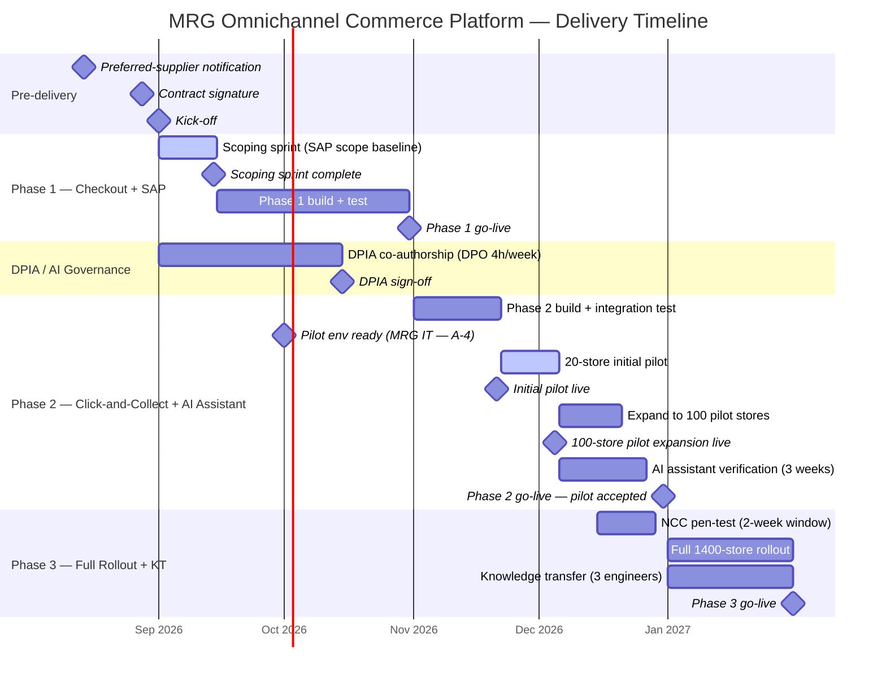

# Milestone Timeline — MRG AI-Enabled Omnichannel Commerce Platform

---

## Dependency Notes

| Dependency | From → To | Risk if broken |
|-----------|----------|----------------|
| Scoping sprint → Phase 1 start | M0 (contract) → M1 (scoping complete) | Without scoping sprint, Phase 1 fixed price is ununderwritten; SAP integration scope unknown |
| DPIA sign-off → Phase 2 entry | M2 (DPIA) → M4 (Phase 2 pilot accepted) | AI assistant cannot go live without DPO sign-off; Phase 2 blocked if DPIA delayed |
| Phase 1 go-live → Phase 2 start | M3 → Phase 2 build start | Phase 2 builds on Phase 1 API layer; cannot begin before checkout modernisation is in production |
| Pilot environment ready → 20-store pilot | M3a (MRG IT) → M4a (20-store pilot) | EPAM cannot deploy click-and-collect to stores without MRG IT environment; delay pushes M4a and compresses AI assistant verification window |
| 20-store pilot sign-off → 100-store expansion | M4a → M4b | Blocking defects in the 20-store pilot must be resolved before expanding; skipping this gate risks a rollback across all 100 stores |
| 100-store pilot + AI verification → Phase 2 accepted | M4b + 3-week AI verification → M4 | AI assistant must be verified in production for ≥3 weeks before Phase 2 payment milestone triggers and Phase 3 is authorised |
| NCC pen-test → Phase 3 go-live | NCC 2-week window → M5 | Critical finding adds ≤2 weeks; if finding emerges in week 19, Phase 3 go-live moves to 2027-02-14 (absorbed by contingency) |
| KT (week 12–16) → Phase 3 exit | KT start → M5 | 3 MRG engineers must be released for KT from week 12; late release compresses KT below L2 sign-off threshold |
