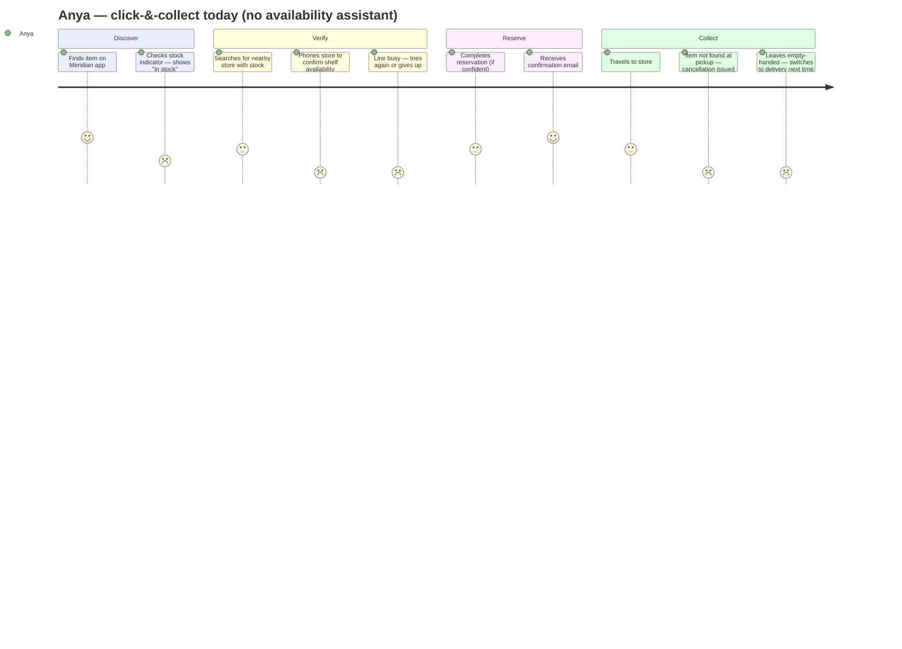

## Persona 1 — Anya, the time-pressured planner

- **Goal:** Reserve with confidence and pick up on the way home — no detour, no wasted trip.
- **Friction:** The stock indicator has burned her before (showed "in stock"; item wasn't there). She no longer trusts it and has added a manual verification step that costs her 5–10 minutes per order.
- **Current workaround:** Phones the store before reserving to ask if the item is physically on the shelf. If the line is busy, she orders delivery instead — paying more to eliminate the uncertainty.

## Persona 2 — Marcus, the spontaneous deal-hunter

- **Goal:** Get the item today at the lowest total cost; delivery fees are a waste.
- **Friction:** Doesn't engage with click-&-collect at all — the reservation flow feels risky and the stock page is meaningless to him ("it always says in stock").
- **Current workaround:** Drives to the nearest store without reserving, treats it as a walk-in. Accepts a failed trip as the cost of saving delivery fees. If the item isn't there he moves on; he never blames the website because he never trusted it.

> **Contrast:** Anya engages with click-&-collect but adds friction to compensate for distrust. Marcus disengages entirely. The assistant targets Anya first — Marcus requires trust-building over multiple successful experiences before he re-engages the reservation flow. *(Personas synthesised from published omnichannel retail research on click-&-collect abandonment patterns — unverified; validate with real Meridian OMS and CX data before committing.)*

---

## Journey map — Anya, click-&-collect with current experience

**Emotional low point:** the phone call that shouldn't be necessary (score 1), and the cancellation at pickup (score 1). Both are caused by the same gap: no trustworthy shelf-level signal between SAP and the shopper.

---

## Top three unmet needs

1. **Pre-reservation shelf signal** — a verdict that distinguishes "in stock in the warehouse / SAP" from "physically on the shelf at this store right now." The current indicator conflates the two.
2. **Confidence disclosure** — not a binary in/out badge but a probability or caveat ("likely available", "uncertain — stock updated 4h ago") so Anya can calibrate her decision rather than default to a phone call.
3. **Fallback guidance when uncertain** — when the assistant can't confirm, it should redirect ("2 items confirmed at the Westfield store, 3.2 km away") rather than leaving Anya with a blank uncertainty and no next step.
