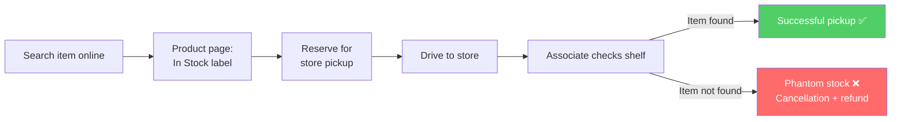

## Click-&-collect journey map — today (as-is)

| Step | Action | Emotion | Frustrations | Drop-off? |
|------|--------|---------|--------------|-----------|
| 1 | Searches for item online | 😊 Hopeful | Search results show no store-level availability; no way to know if pickup is viable before clicking into the product | |
| 2 | Product page shows "In stock" | 🙂 Optimistic | Binary label with no store specified, no recency signal, no confidence cue; shopper can't tell whether it means "in warehouse" or "on the shelf near me" | |
| 3 | Selects store and reserves for pickup | 😊 Confident | No confirmation that the shelf matches the signal; no hold placed; shopper commits trip on faith | |
| 4 | Drives to store | 😬 Committed / anxious | Time and fuel already spent; no way to verify availability en route; anxiety increases the closer they get | |
| 5 | Store associate checks shelf | 😐 Tense | Depends on associate speed; shopper waits at the counter with no progress signal | |
| 6 | Item is not there (phantom stock) | 😡 Frustrated / betrayed | Trip was wasted; "In stock" label was wrong; trust in click-&-collect erodes; cancellation issued | ⭐ DROP-OFF |
| 7 | Cancellation and refund offered | 😔 Resigned / distrustful | Refund process; lost time can't be recovered; shopper decides never to use click-&-collect again | |

**Single worst emotion step:** Step 6 — item not there. This is the redesign target. Everything upstream leads to this moment; the fix must address the promise made at Step 2.

---

## Mermaid journey flow (optional visual)

---

## Heuristic review — Nielsen's 10 heuristics

| # | Heuristic violated | Finding | Screen element |
|---|-------------------|---------|----------------|
| H1 | **Visibility of system status** | The "In stock" label carries no timestamp, confidence level, or sync recency. The shopper cannot tell how current the data is or whether the system is operating normally. | Product page: availability label |
| H5 | **Error prevention** | The reservation flow allows a shopper to commit a trip on an uncertain signal without any warning or friction. No gate prevents reservation on a stale or low-confidence stock read. | Product page + reservation confirmation |
| H9 | **Help users recognise, diagnose, recover from errors** | When the item is not at the store, there is no in-product path to recovery — no alternative store, no delivery option, no next-step guidance. The associate handles recovery ad hoc at the counter. | Pickup counter (no screen — gap) |
| H10 | **Help and documentation** | After a cancellation, there is no guidance on what the shopper can do differently next time (check a different store, choose delivery, call ahead). The system teaches nothing from the failure. | Post-cancellation state (none exists) |

**Confirmed against lived friction:** H1 and H5 are the primary design-intervention points. H9 and H10 surface the absence of a recovery path — also addressed by the AI feature. All four findings name the heuristic violated and quote the screen element or its absence.
