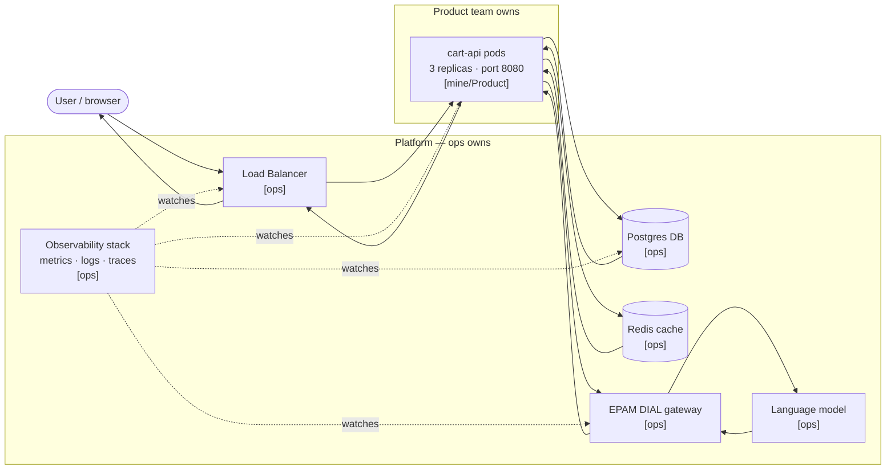

# K 8.W.1 — Stack map: cart-api

**Service:** cart-api — checkout service, Meridian Retail Group  
**Brief:** Runs as containers on a Kubernetes cluster behind a load balancer; reads and writes a Postgres database; caches in Redis; for the "summarise my cart" step it calls a language model through EPAM DIAL. ~3,000,000 AI calls/month.

---

## Component map — request path (front to back)

---

## Component ownership table

| Component | Role | Owner |
|-----------|------|-------|
| Load balancer | Terminates TLS, routes HTTP traffic to healthy pods | **[ops]** |
| cart-api pods (×3) | Business logic: cart read/write + AI summarise step | **[mine/Product]** |
| Postgres database | Durable cart and order state | **[ops]** |
| Redis cache | Session and cart caching, sub-millisecond reads | **[ops]** |
| EPAM DIAL gateway | AI API routing, auth, token metering, cost cap enforcement | **[ops]** |
| Language model (LLM) | Generates cart summaries on demand (~3M calls/month) | **[ops]** |
| Observability stack | Collects metrics, logs, traces; fires alerts | **[ops]** |

**Ownership rule:** the app's *behaviour* (what cart-api does, its business logic, its code) is `[mine/Product]`. The *floor* it runs on — the load balancer, the database, the cache, the gateway, the cluster, the observability stack — is `[ops]`.

---

## What this map reveals for the rest of the series

- **Six ops-owned components** sit under one product-owned service. An outage in any of them is not the product team's fault but is their problem until ops responds.
- **The DIAL gateway** is the component that makes `cart-api` an AI app, not just a CRUD service — it adds a token meter and a cost signal the observability stack alone won't surface.
- **Observability watches everything** — but a green dashboard only reports what it is asked to watch. Two failure modes it still misses: silent wrong answers (all 200 OKs, bad content) and latency degradation that stays below the error threshold.
